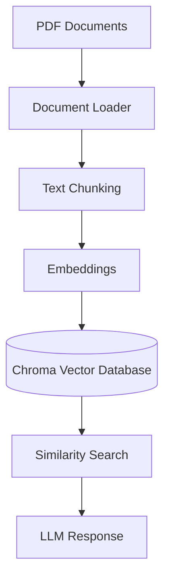

# 🤖 AVA — Multi-Agent AI Assistant

**AVA** is a multi-agent AI assistant that understands user queries, routes them to the right specialized agent, retrieves information from documents when needed, and generates accurate, context-aware responses — all through a custom Streamlit interface.

Built as a hands-on exploration of **agentic AI systems**, **LangGraph orchestration**, and **Retrieval-Augmented Generation (RAG)**.

---

## 🌟 Features:

| 🧭 | Multi-agent architecture with a supervisor agent for query routing |
| 📚 | Retrieval-Augmented Generation (RAG) over your own PDF documents |
| 🗂️ | Vector database integration (ChromaDB) for semantic search |
| 💬 | Context-aware, conversational responses |
| ✅ | Built-in task management agent |
| ⚡ | Lazy-loaded RAG pipeline (only initializes when actually needed) |
| 🎨 | Custom, fully interactive Streamlit UI |

---

## 🏗️ Architecture

             User
              |
              ↓
        AVA Interface
        (Streamlit UI)
              |
              ↓
      Supervisor Agent
              |
    -------------------
    |        |        |
    ↓        ↓        ↓
 General    RAG    Task Agent
 Agent     Agent
              |
              ↓
      Vector Database
      (ChromaDB)
              |
              ↓
          LLM Response

The **supervisor agent** is the entry point for every query. It decides — based on intent — whether the request needs a conversational reply, a document lookup via RAG, or a task-management action, and routes it to the corresponding specialized agent.

---

## 🧠 How AVA Works

1. The user submits a query through the Streamlit interface.
2. The **supervisor agent** analyzes the request and determines intent.
3. The query is routed to the appropriate specialized agent (general, RAG, or task).
4. If document context is required, the **RAG agent** retrieves relevant chunks from the vector database.
5. The **LLM** generates a final response using the query plus any retrieved context.
6. The response is returned to the UI and displayed with its originating agent labeled.

---

## 🛠️ Tech Stack

**AI / Backend**
- Python
- LangGraph — multi-agent orchestration
- LangChain — LLM tooling and chains
- Ollama — local LLM inference
- ChromaDB — vector database for RAG

**Frontend**
- Streamlit — interactive web UI

**Tooling**
- Git & GitHub

---

## 📂 Project Structure

```
AVA-AI-Assistant/
├── app.py                  # Streamlit entry point / UI
├── styles.css               # Custom UI styling
├── chats.json                # Persisted chat history
├── tasks.json                 # Persisted task list
│
├── agent_v2/
│   ├── graph.py             # LangGraph agent graph + routing logic
│   ├── llm.py               # LLM client / configuration
│   ├── agents/
│   │   ├── rag.py           # RAG agent implementation
│   │   └── ...              # Other specialized agents
│   └── data/                # Uploaded PDF documents for RAG
│
├── chroma_db/                # Persisted vector database
└── README.md
```

---

## 🚀 Getting Started

### Prerequisites
- Python 3.10+
- [Ollama](https://ollama.com) installed locally, with the required model(s) pulled

### 1. Clone the repository
```bash
git clone <repository-url>
cd AVA-AI-Assistant
```

### 2. Install dependencies
```bash
pip install -r requirements.txt
```

### 3. Start Ollama
Make sure Ollama is running and the required model(s) are pulled, e.g.:
```bash
ollama pull llama3.2
ollama serve
```

### 4. Run the app
```bash
streamlit run app.py
```

The app will be available at `http://localhost:8501`.

---

## 📖 RAG Pipeline

AVA uses Retrieval-Augmented Generation to answer questions grounded in your own uploaded documents, rather than relying purely on the model's built-in knowledge.



When a query is routed to the RAG agent, the most semantically relevant chunks are retrieved from ChromaDB and passed to the LLM alongside the original query, grounding the response in the actual document content.

---

## 🗺️ Roadmap

- [ ] Cloud deployment
- [ ] Additional specialized agents
- [ ] Voice interaction
- [ ] Long-term memory across sessions
- [ ] Improved UI animations

---

## ✍️ Author

**Anvesha Bishnoi**
Built as an exploration of agentic AI systems, LangGraph workflows, and RAG-based applications.
